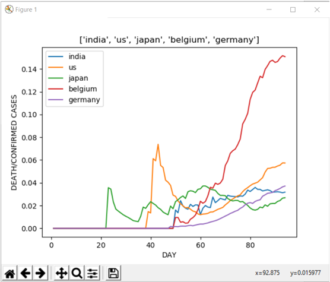
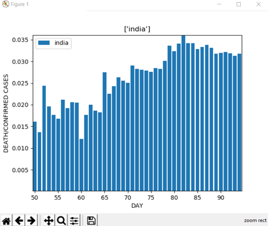
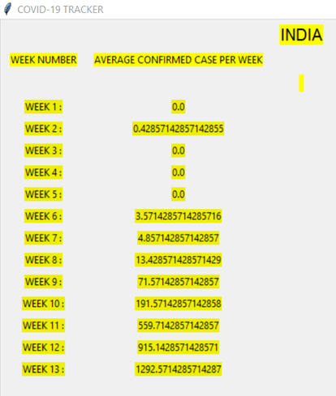
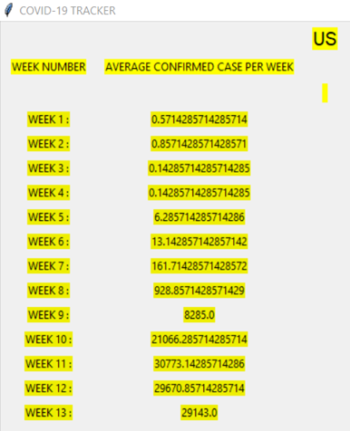
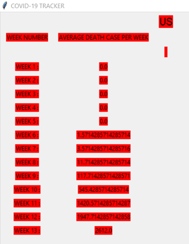
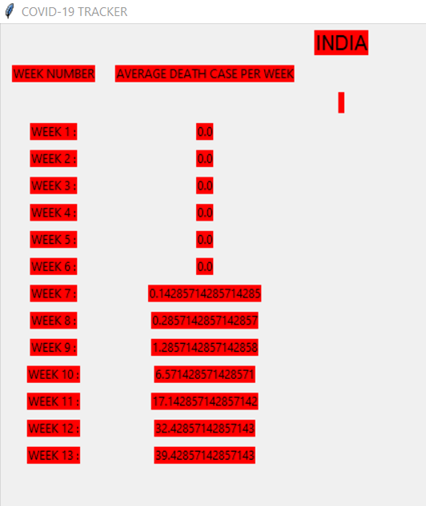
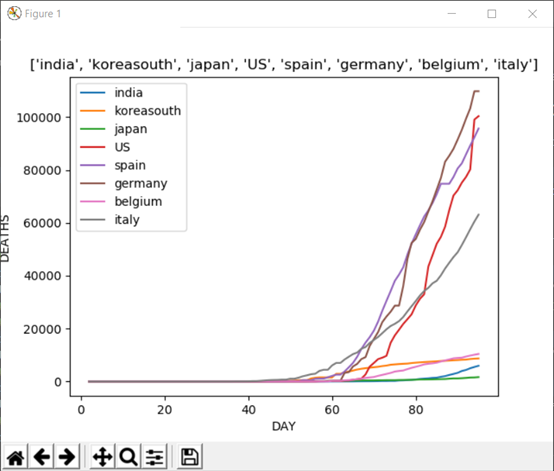

# COVID-19-TRACKER
**ANALYSIS BY YASHARTH DUBEY**

 

## COVID-19 DATA ANALYSIS FOR EDUCATION PURP0SES
### PROBLEMS SELECTED:

1.	Identity the countries as some **HIGH RISK TRAVEL** text destination countries for Internship or Project work for next two years.
Draw a trend graph of death growing rate for that country . The graph may
change as the data set is dynamic. Collect the death growing rate (fatality
or mortality).

2.	Find:
 
       a)	Average number of cases confirmed week wise.
 
       b)	Average number of cases cured week wise. 
 
       c)	Average number of death cases reported week wise.

3.  To estimate the chances of infection according to the answered set of questions.

 

### PURPOSE OF RESEARCH: -

1.	To find out those countries which are at high risk for travel destination for students for internships. So, they can avoid travelling to those countries for next two years.

2.	To find average number of cases confirmed every week .To check how fast virus is spreading in the world.

3.	To find out the Average number of cases cured every week ,so that we can know how to control  its  spreading .

4.	To find out the average number of deaths cases reported every week. 

### IMPORTANT OBSERVATION FOUND IN DATA STUDY: -

1.	After looking at data for counting confirmed, death cases country wise we observed that Nowadays U.S.A. is at very high risk having more than 7 lakhs of active cases. And having more than 50 thousand of deaths. And it has become unsafe country
2.	So, our second observation was about the day wise data for deaths per confirmed cases. As you can see the graph below which is 

We can compare the data of different countries with these feature its death/confirm rate per day and what we can see is graph for all the countries are showing an upward trend except of 3 countries which are South Korea, Japan and China.

Now let us talk about our country which is India the graph of India is given below to study the data more efficiently 

So, for a detailed study we have plotted the bar graph what we are seeing here is that there is very little growth. After **the Nazimuddin jamaat incident on 27/03/2020 after 5 days of this there was a tremendous growth in the confirmed cases due to which the death per confirmed cases went low and after 7 days of it, it again starts to go upward as the death increased due to this.** As we can see the lockdown was not obeyed by the people which resulted in the increase in confirmed cases, we can see this trend after seeing the week wise data below.
 
This is showing us the trend of confirmed cases in the country we can see sharp growth in the data in week 9 it was the week were the Nazimuddin incident happened. Now we should see the confirmed cases of the worst hit country which is US.
       

What we can see is the week wise confirmed cases in us were not showing a regular trend but rather a high low high low trend.
Now we should talk about the week wise deaths in countries so as we can see that here also the worst hit country is US. Let us see the data for it. 

What we see in the above data is the deaths are more than any other country and the rate by which it is going up is very alarming one main observation which we can take out is the that in us the patients in the age group of 45-85 are highest which is causing the death to be more and one more observation we get is the immunity of the people in the west is much lower than in the east. That is why it is said not to eat packed food.   

Now we are talking about the data of India we should take a look below 

What we can see here is the data trends show us that the death in India is pretty low and not only India but same is for japan and South Korea (**we are not including china as the data provided by Chinese media are questionable**). What we can conclude from this week wise death data is the death depends on the age group and immunity of the person and the Asian continent has registered low number of deaths because of the high immunity power and having a large number of cases in the age between 15-25. Some countries in Europe are also handling the problem very well namely France and Germany. 

We are now going to talk about the graphical data of Recovered cases in India, Japan, South Korea, US, Germany, Belgium, Italy and Spain.

   
 

We can see here that the recovered patients are growing everywhere but the rate with which countries are recovering are more in European countries.
Below is the calculated recovery rate of some countries:

US: 2.17 

SPAIN: 4.71

ITALY: 2.39

GERMANY: 18.68

SOUTH KOREA: 36.020

JAPAN: 4.6

INDIA: 7.19

BELGIUM: 1.54

The countries with higher number of active cases are hard to predict but the low recovery rate of the countries like Spain, Belgium, Italy, and US is showing us that we need to invest more in developing our health care than to prepare weapons for war **NOW WE SHOULD UNDERSTAND THAT WE CANT KILL A VIRUS BY NUCLEAR WEAPON.**

If we see the continent wise break up then the rank would be:
1. NORTH AMERICA
2. EUROPE
3. ASIA
4. SOUTH AMERICA
5. AUSTRALIA AND OCEANIA 
6. AFRICA 

The trend which will amaze us is that the epicentre of the pandemic was Asia and still it is in 3rd place. As it is an air borne disease. It should spread largely in poor countries but Africa is still in the last this shows us that the continent which are densely populated are more affected by it.
So, these were the observation we found out from the data study.
 

 

###  Data files and it’s references: -

1.	recovered time series: https://github.com/CSSEGISandData/COVID-19/blob/master/csse_covid_19_data/csse_covid_19_time_series/time_series_covid19_recovered_global.csv

2.	death time series: https://github.com/CSSEGISandData/COVID-19/blob/master/csse_covid_19_data/csse_covid_19_time_series/time_series_covid19_deaths_global.csv

3.	confirmed time data: https://github.com/CSSEGISandData/COVID-19/blob/master/csse_covid_19_data/csse_covid_19_time_series/time_series_covid19_confirmed_global.csv

4.	 Count: https://www.worldometers.info/coronavirus 

### Data types or data structures used: -

1.	list.
2.	Strings
3.	Excel file
We have also used bs4 for web scrapping, tkinter for graphics and also matplot library for graphs, xlrd, openplyx, xlwt for working in excel sheets.

RESULT DESCRIPTION: -

The following countries are at very high risk for travel:
1.	U.S.A
2.	Spain
3.	Italy
4.	France 
5.	Germany
6.	U.K
7.	Turkey
8.	Iran
9.	Brazil 
10.	Belgium

So, these are top 10 most risky travel destination countries for internships or project work for next two years.

So, students are advice to avoid travelling to these countries.  

